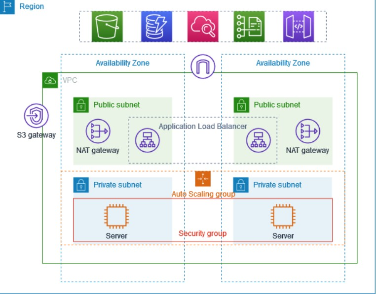

# Secure VPC Setup with EC2 Instances

This project demonstrates how to set up a secure Virtual Private Cloud (VPC) on AWS with EC2 instances, including:

- Creation of a custom VPC with public and private subnets.
- Configuration of network security using Security Groups and Network ACLs.
- Launching EC2 instances with appropriate IAM roles and security configurations.
- Configuring routing for internet access and secure outbound traffic.

## Steps:

1. **Design and Configure the VPC**
   - Custom IP ranges.
   - Public and private subnets.

2. **Network Security**
   - Network ACLs to control traffic.
   - Security Groups for EC2 instances.

3. **Provision EC2 Instances**
   - Launch EC2 instances in public and private subnets.
   - Configure security groups and IAM roles.

4. **Networking and Routing**
   - Set up an Internet Gateway for public subnet access.
   - Use NAT Gateway/Instance for private subnet access.

5. **Access Control**
   - SSH Key pair for secure access.
   - IAM roles and policies to control resource access.

6. **Testing and Validation**
   - SSH access to instances and validation of connectivity.
